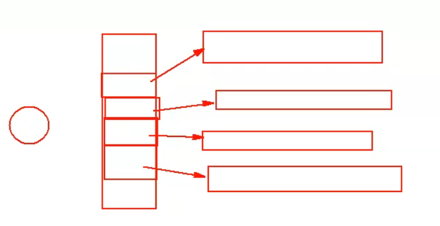
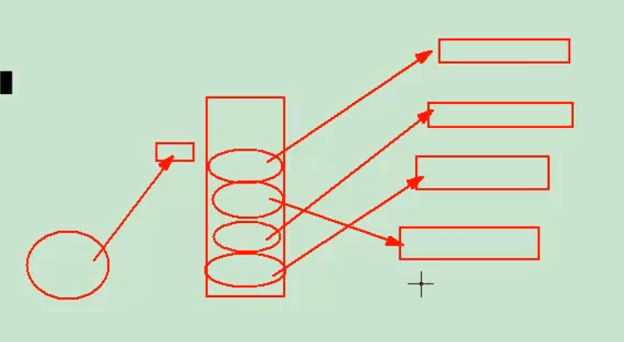

# 3-指针

## 概述

C语言中的地址用point去描述

指针是内存类型资源地址、门牌号的代名词


指针 -> 就是地址的代名词

指针变量 -> 存放指针这个东西的盒子

```c
int a;
*p
```

C语言编译器对指针这个特殊的概念，有2个疑问

1、分配一个空间，空间要多大？

    在32位系统中，这个指针就4个字节（要涵盖2^32个地址，取决于系统的位数） <- 目的是存放地址

    指针的大小sizeof是固定的

2、空间里存放的地址 所指向 内存的读取方法是什么？

    读取方法取决于前面定义的数据类型，即指针读取包括首地址和要读的大小（大小取决于数据类型）

    指针的变量有**首地址**和**读取长度**两个重要属性


指针指向内存空间，一定要保证**合法性**


## 指针修饰符

### const

常量修饰 -> 只读【不能变】

```c
const char *p;
char const *p;
char *const p;
char *p const;
```

其中 `char const`  与 `const char`	等价

其中 `char * const p` 与 `char *p const` 等价

推荐使用 `const char *p` 和 `char *const p`分别表示常量指针和指针常量

#### 常量指针

`const char *p` 表示常量指针，即指向常量的指针，内容不允许修改，指针可以修改，往往用在**字符串**上

`const char *p = "hello world"`

#### 指针常量

`char * const p` 表示指针常量，即指针是一个常量，永远指向一个地址，不允许修改这个地址，往往用于表示**硬件资源**


`const char * const p`	地址和内容均是常量


### volatile

防止优化指向内存地址，开关编译器优化的修饰符

防止软件优化掉，往往用于**外界硬件**控制信号的变量

`volatile char *p`


### typedef

起别名xxx_t

```c
char *name_t		name_t是一个指针，指向了一个char类型的内存
typedef char *name_t	name_t是一个指针类型的名称，指向了一个
```

这样我们直接使用name_t来定义这个指针


## 指针与运算符

### 指针基本运算

`int *p = xxx`

`p+1    => [p] + 1 * sizeof(*p)`

指针+1是向下移动一个单位，指针的加法运算，实际上加的是一个单位，单位的大小可以使用sizeof得到

`p++ 就是自增 p = p + 1`


### 指针标签访问[]

变量名[n] == *（变量名 + n}

地址内容的标签访问

`char *p    *(p+2)  ==  p[2]`

使用[]获取的是指针下的内容，使用p+n获取的是地址


### 强制类型转换

```
#include <stdio.h>

int main(){
	int a = 0x12345678;
	int b = 0x99999999;

	int *p1 = &b;

	char *p2 = (char *)&b;

	return 0;
}
```


### 多级指针

**指向指针**的**指针**

`int **p`



通过多级指针可以实现逻辑上的连续存储！



多维指针的结束可以通过NULL来判断

`argv[i] == NULL	表示结束了`


## 数组

指针变量的特殊化 -> 数组

数组是内存分配的一种形式

定义一个空间：

    1、大小

    2、读取方式

数组的定义必须有一个数组名

  `数据类型 数组名[m]`

m就是数组的大小，m的作用域是在申请的时候

`int a[100];`


### 初始化

空间的赋值

    按照标签**逐一处理**

`int a[10];`

`a[0] = xx;`

`a[1] = xx;`


初始化赋值即在空间定义时，就告知编译器的初始化情况，空间的第一次赋值，初始化操作。

    数组空间的初始化 和 变量的初始化 本质不同

字符串拷贝推荐使用 `strncpy()` 而 `strcpy()`会导致内存泄露

内存拷贝 `memcpy()	注意尺寸要乘以sizeof`

```c
int buf[10];
int sensor_buf[100];

memcpy(buf, sensor_buf, 10 * sizeof(int));
```


### 结构体字节对齐

使用对齐，牺牲一点空间间接换取时间的效率，常见4字节对齐

```c
#include <stdio.h>
struct abc{
	char a;
	short e;
	int b;
};

struct my{
	char a;
	int b;
	short e;
};

int main(){
	struct abc buf;
	struct my buf1;
	printf("the buf is %lu, the buf1 is %lu\n", sizeof(buf), sizeof(buf1));
	return 0;

}
```

打包顺序导致字节对齐形式不同，两个struct的sizeof不同

最终结构体大小**一定是4的倍数**


## 内存

内存的属性：

    1、大小

    2、在哪里

我们定义一个变量的时候，要不断去思考这两个问题

查看地址尽量使用`%p`

标签就是地址，例如 `main` 标签

C语言内存空间由低到高分配如下

|      空间      | 作用                                    |
| :------------: | --------------------------------------- |
|    内核空间    | 应用程序不许访问                        |
|     栈空间     | 局部变量                                |
| 运行时的堆空间 | malloc                                  |
|  全局数据空间  | 初始化的data，未初始化的bss<br />static |
|   只读数据段   | const                                   |
|     代码段     | code                                    |

使用 

`size xxx` 可以看空间分配情况

`nm` 指令可以更详细看


### 栈空间

临时存储函数里定义的变量

局部变量	可读可写

函数内部的变量，函数一旦返回，就释放内存


### 堆空间

运行时分配到的空间，往往使用malloc动态分配

运行时可以自我管理分配和释放的空间，称之为堆空间，生存周期由程序员来决定


分配：

`malloc()` 一旦成功，返回分配好的地址

```c
*p
p = malloc()
```

对于这个新地址的读法，由程序员灵活把握，输入参数指定分配的大小，单位就是B（字节）

```c
char *p;
p = (char *)malloc(sizeof(char));

if(p == NULL){
	'''error'''
}
```


释放：

使用malloc分配的空间，一定注意使用 `free()` 进行释放，如果在函数中定义的，当函数结束后，很难释放，切记成对成域使用

```c
free(p);
```

```c
char *p;
p = (char *)malloc(sizeof(char));
if(!p){
	return -1;
}

free(p);
```

### 只读空间

只读空间包括：全局数据空间、只读数据段、代码段

代码段是只读的，会进行保护，若尝试在执行中修改代码段，会报段错误 `Segmentation fault`

静态控件，整个程序结束，释放内存
